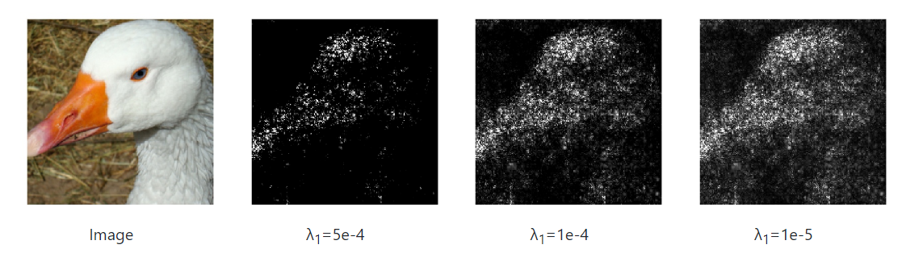
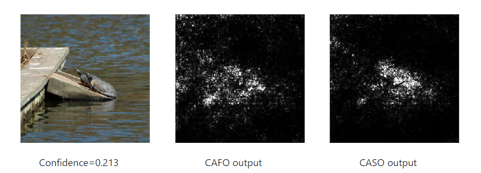
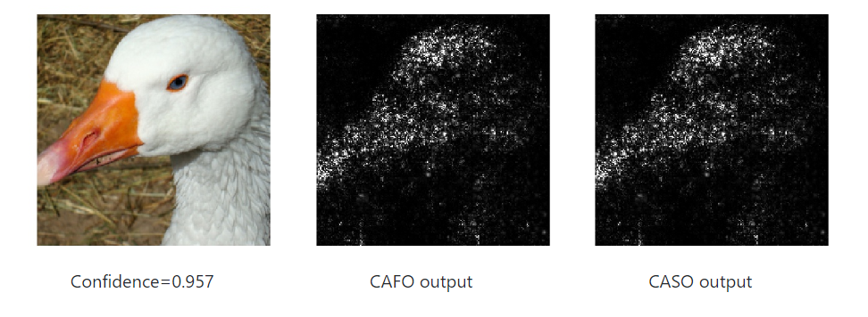

Context Aware Second-Order Interpretation
=====================================

Code for reproducing experiments in ["Understanding Impacts of High-Order Loss Approximations and Features in Deep Learning Interpretation"](https://arxiv.org/abs/1902.00407).

## Prerequisites

- Python, NumPy, Pytorch, Argparse, Matplotlib
- A recent NVIDIA GPU

## Basic Usage

To evaluate the interpretation with default parameters on the given toy image, run python main.py. To access all the parameters use python main.py --help.

## Examples

To generate the following examples use python main.py --lambda1 LAMBDA

	<figure style='float: center; margin-left: 5px; margin-right: 5px;'>
		
	</figure>

 
To generate the CAFO example, use python .\main.py --image_path=IMAGE_NAME --lambda1=0 --magnitude  
For the CASO example, use python .\main.py --image_path==IMAGE_NAME --lambda1=0 --magnitude --second-order

	<figure style='float: center; margin-left: 5px; margin-right: 5px;'>
		
	</figure>
	<figure style='float: center; margin-left: 5px; margin-right: 5px;'>
		
	</figure>

